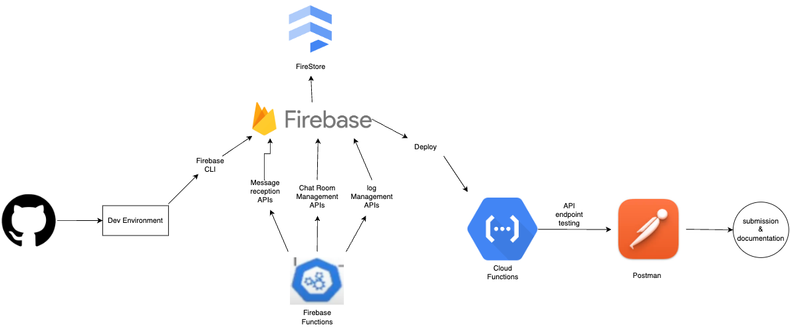

# QuantumBot Core

## Description
QuantumChat Bot is a revolutionary project designed to address the challenges of modern communication. In today’s fast-paced world, individuals and teams often struggle with maintaining effective communication due to the barriers of distance and disconnection. This can lead to a lack of synchronization and productivity, hindering the success of collaborative endeavors.

The QuantumChat Bot project aims to overcome these obstacles by providing a platform for instantaneous and continuous dialogue. This platform is not just a chatbot; it’s a comprehensive solution designed to facilitate real-time interactions, ensuring the reliability and speed of communications on the platform.

The project leverages Firebase’s robust backend solutions to handle large volumes of real-time data with minimal latency. One of the key components of this backend is Cloud Firestore, a scalable database solution that ensures data consistency and reliability across all user interactions. This integration allows QuantumChat Bot to operate efficiently across various devices and networks without sacrificing speed or user experience.

## Getting Started

These instructions will get you a copy of the project up and running on your local machine for development and testing purposes.

### Prerequisites

- Node.js and npm
- Firebase CLI
- Firebase Functions
- Firebase Firestore Database
- Postman

### Installing

1. First install Node.js, npm, and Firebase CLI tools onto your computer
    - Use this link to install Node.js and npm: https://nodejs.org/en/download/package-manager
    - To install Firebase CLI tools use the command: `npm install -g firebase-tools`
2. Go to the Firebase console, create/sign-in to an account, and create a project through the console by first naming the project.
3. Once the project is created, go to the project's settings and navigate to your apps. Select the web option, register a name to the app, enable Firebase Hosting for the app, click on 'register app', then click on 'continue' to navigate through the rest of the steps stated (these steps will be explained later on)
4. Configure your Firebase project's Cloud FireStore database by clicking the "create database" button within Firestore, set the name and location as default, click next, and then secure the rules by starting the data structure in test mode, then click create.
5. To gain access creating Cloud Functions on your Firebase project, upgrade your project's plan to the Blaze (pay-as-you-go) option, then click continue, then set a billing budget as you see fit, then click create.
6. Open up a new terminal and begin with cloning the repository: `git clone <repository-url>`
7. Navigate into the root project directory: `cd Rex-chatbot`
8. Install dependencies: `npm install`
9. Log in to Firebase CLI: `firebase login`
10. Initialize Firebase: `firebase init`
11. Select `Firestore` as the database and `Functions` as the setup for the api endpoints
12. Select the option to use an existing project and to select the project that you created beforehand
13. Hit enter to access the firestore.rules file and fire.indexes.json file
14. Select javascript as the language to use to write the Cloud functions
15. Enter `y` to use ESLint to catch any bugs before deploying said functions
16. Enter `n` to don't overwrite the next four files (with are the package.json, .eslintrc.js, index.js, and .gitingore files)
17. Enter `y` to then install the dependecies with npm
18. Now your ready to deploy the functions to firebase!!!

## Deployment

To deploy the functions to Firebase, run: `firebase deploy --only functions`

## Usage

The project includes the following Firebase Cloud Functions:

### chat room management APIs
- `createChatRoom`: creates a new chat room that the user can engaged in a new conversation in.
- `getAllChatRooms`: Retrieves all of the chat rooms that the user has made (shows chat rooms that are active and ended, but not deleted).
- `getAChatRoom`: Retrieves a specific chat room that the user has made
- `updateChatRoomStatus`: Updates the status of whether a chat room is deemed active or has ended.
- `deleteChatRoom`: Deletes a chat room that the user has made.

### message reception APIs
- `postMessage`: Posts a new message to a chat.
- `getChatMessages`: Retrieves all messages from a specific chat of a specific user.
- `getAMessage`: Gets a message from a specific chat of a specific user.

### log management APIs
- `postLogs`: Posts a new log event for monitoring and troubleshooting.
- `updateLogs`: Updates an existing log event.
- `deleteLogs`: Deletes a log event  based on its id.
- `getLogs`: Retrieves a specific log event based on its id.

## Workflow diagram

## Testing

In regards to how I when about testing my Firebase Functions, I used Postman and created API requests via HTTP to help ensure that my functions are robust and rebeliable before deployment. For the POST and PUT methods, I tested them by first pasting the http link given by said function within the firebase console, then added a key-value pair header for the Content-type (in that it was application/json), and then added the data body of said request as a raw json object. For the DELETE and GET methods, I tested them by first pasting the http link given by said function within the firebase console, and then added the neccessary query parameters to said http link as a key-value pair. Once, I created my tested, then I clicked the send button to ensure that the Firebase function works as expected. Here's a link to the Postman workspace that I created to test out the different Cloud functions: https://www.postman.com/descent-module-astronomer-60072393/workspace/rex-chatbot-testing/collection/27615271-3a19dec5-23d0-4043-9173-e63235851fdb?action=share&creator=27615271
